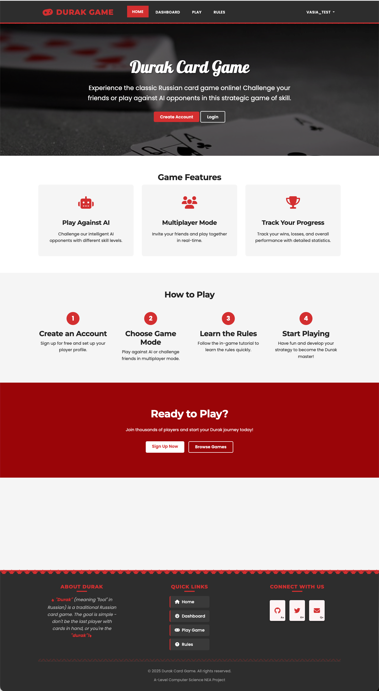
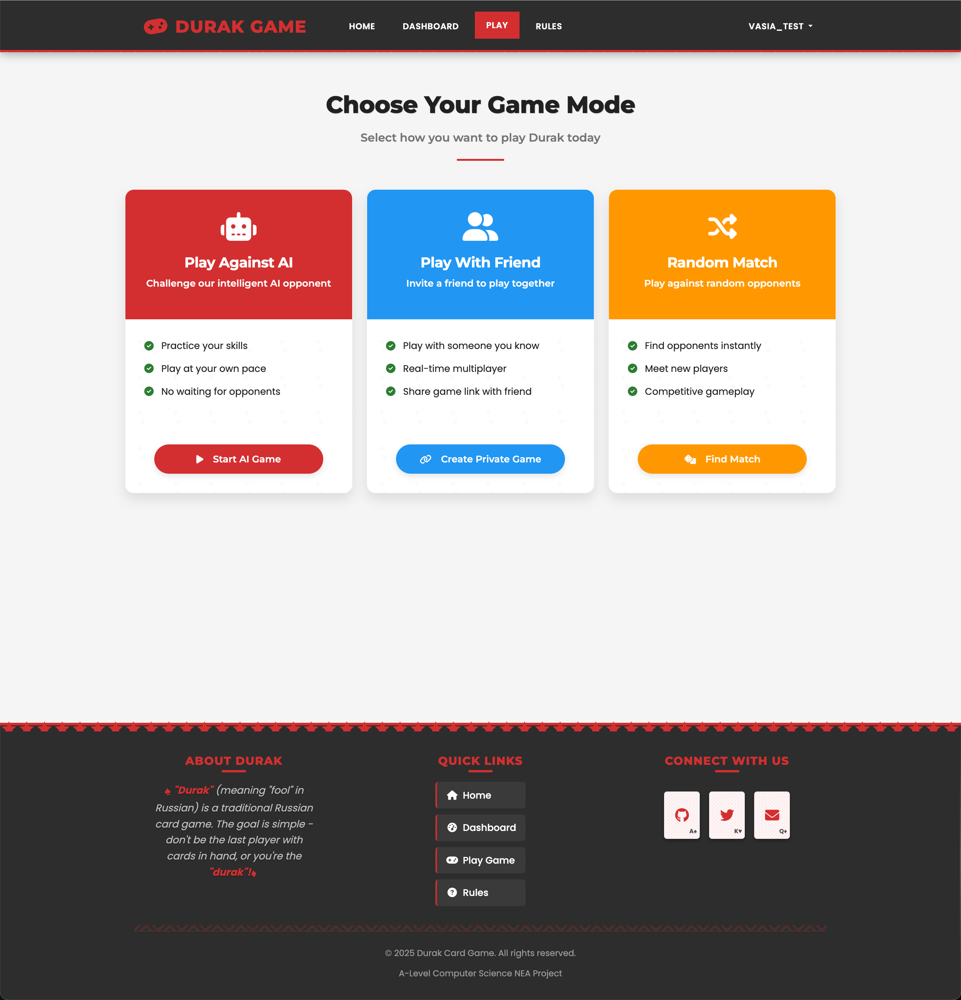
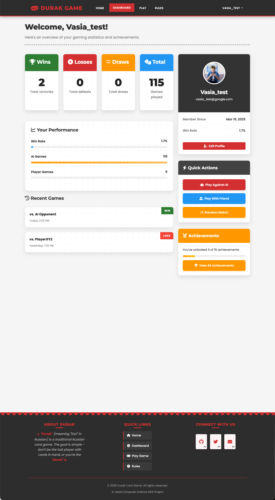
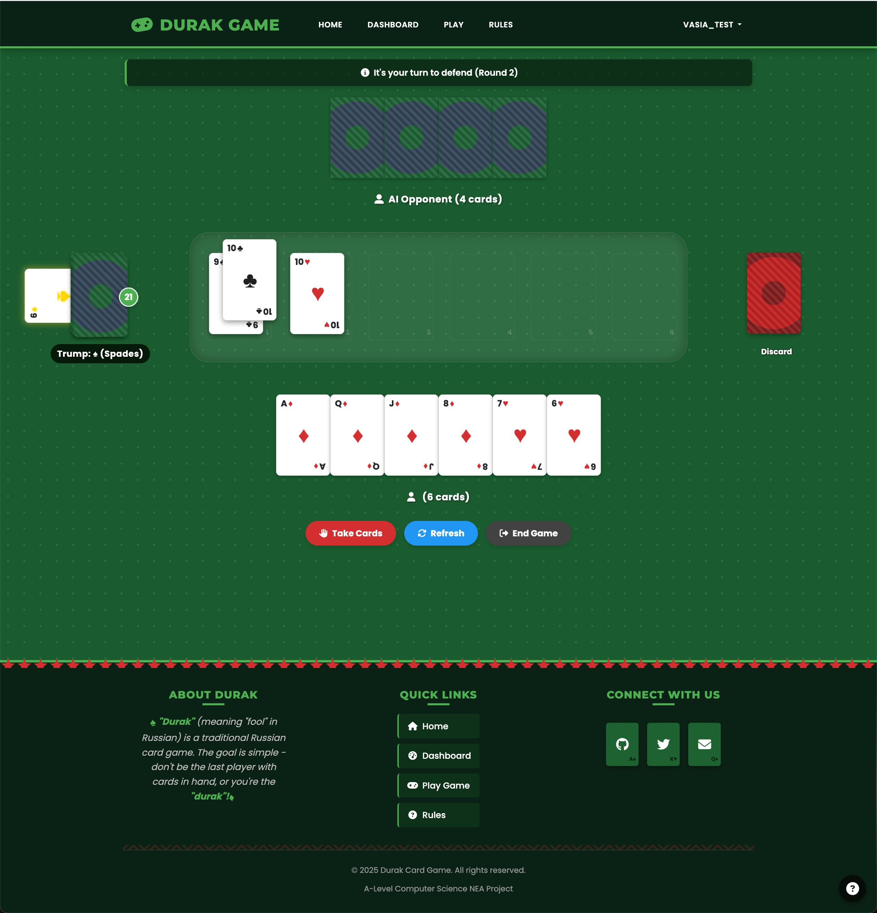

# Durak Card Game 🃏


## Project Overview

Durak is a popular card game in Russia. This project is a web-based version of the game built using Python Flask. The application includes features like user registration, real-time gameplay using WebSockets, and an AI opponent that provides a challenging gameplay experience.




## Table of Contents

- [Project Overview](#project-overview)
- [Features](#features)
- [Installation](#installation)
- [Usage](#usage)
- [Game Rules](#game-rules)
- [Project Structure](#project-structure)
- [Technologies Used](#technologies-used)
- [Development Challenges](#development-challenges)
- [Contributing](#contributing)
- [License](#license)

## Features

### Core Game Features 🎮
- **Single-player mode** against AI opponent
- **Authentic Durak rules** with trump cards, attacking, and defending mechanics
- **Real-time game updates** using WebSockets
- **Visual card animations** for smooth gameplay experience



### User Management 👤
- **User registration and authentication**
- **Profile management** with statistics tracking
- **Game history** to review past performances



### User Interface 🖼️
- **Responsive design** for desktop and mobile play
- **Interactive card interface** with attack and defense mechanics
- **Trump card display** and game state indicators
- **Visual feedback** for turns, successful/failed moves



### Technical Features ⚙️
- **Module-based architecture** with separation of concerns
- **Real-time event system** using Socket.IO
- **State management** for complex game logic
- **Database integration** for user data and game history

## Installation

### Prerequisites 📋
- Python 3.8 or higher
- pip (Python package manager)
- Git (optional, for cloning the repository)

### Setup Steps 🛠️

1. **Clone the repository**
   ```bash
   git clone https://github.com/yourusername/durak-card-game.git
   cd durak-card-game
   ```

   Alternatively, you can download the ZIP file and extract it to your preferred location.

2. **Create and activate a virtual environment**
   ```bash
   python -m venv venv
   
   # On Windows:
   venv\Scripts\activate
   
   # On macOS/Linux:
   source venv/bin/activate
   ```

3. **Install dependencies**
   ```bash
   pip install -r requirements.txt
   ```

4. **Initialize the database**
   ```bash
   # Set up database migrations
   flask db init

   # Create the initial migration
   flask db migrate -m "Initial migration"

   # Apply migrations to the database
   flask db upgrade
   ```

5. **Run the application**
   ```bash
   # Standard method
   python run.py
   
   # Alternative method using Flask CLI
   flask run --port=5001
   
   # Using Docker (if Docker is installed)
   docker-compose up --build
   ```

6. **Access the application**
   - Open your browser and navigate to `http://localhost:5001/`
   - Register a new account or use the default test account (if available)
   - Navigate to the game section to start playing!

## Usage

### Getting Started 🚀

1. **Register an account** or log in if you already have one
2. **Navigate to the game dashboard** to see your statistics and game options
3. **Select "Play against AI"** to start a new game against the computer opponent
4. **Enjoy the game!**

### Game Modes

- **Play Against AI**: Challenge the computer opponent
- **Play With Friend**: (Future feature) Play against a friend on the same device
- **Random Match**: (Future feature) Match with random online opponents
- **Practice Mode**: (Future feature) Play without affecting your statistics

### Controls 🎮

- **Click on a card** in your hand to select it
- **Click again or double-click** to play the selected card
- **Use the "Pass" button** when you want to end your attack turn
- **Use the "Take Cards" button** when you can't or don't want to defend

### Interface Elements 🖥️

- **Your hand**: Cards at the bottom of the screen
- **Opponent's hand**: Cards at the top (backs only)
- **Board**: Center area where attack and defense pairs are displayed
- **Deck**: Left side showing remaining cards
- **Trump card**: Displayed underneath the deck
- **Discard pile**: Right side showing discarded cards

## Game Rules

### Basic Rules 📜

Durak (meaning "fool" in Russian) is a card game where the objective is to get rid of all your cards. The last player with cards is the "durak" (fool).

### Cards and Deck 🃏

- A standard 36-card deck is used (from 6 to Ace in each suit)
- Card ranking from lowest to highest: 6, 7, 8, 9, 10, Jack, Queen, King, Ace
- One card is placed face up after dealing to determine the trump suit
- Trump cards beat any card of another suit regardless of rank

### Game Flow 🔄

1. **Setup**: 
   - Each player is dealt 6 cards
   - One card is placed face up to determine the trump suit
   - The player with the lowest trump card becomes the first attacker

2. **Attack Phase**:
   - The attacker can play any card to start an attack
   - After the first attack card, additional attack cards must match the rank of a card already on the table
   - The attacker can play as many cards as the defender has in their hand
   - The attacker can choose to end their attack at any time

3. **Defense Phase**:
   - The defender must beat each attack card with either:
     - A higher card of the same suit
     - Any trump card (if the attack card is not trump)
   - The defender must defend against all attack cards or take all cards on the table
   - The defender cannot counter-attack during their defense

4. **Round Resolution**:
   - **Successful Defense**: If the defender beats all attack cards, all cards on the table go to the discard pile. The defender becomes the new attacker.
   - **Failed Defense**: If the defender cannot or chooses not to defend, they take all cards on the table. The attacker remains the attacker for the next round.

5. **Card Replenishment**:
   - After each round, players draw from the deck until they have 6 cards
   - The attacker draws cards first, then the defender
   - When the deck is depleted except for the trump card, the trump card is given to the player who needs to draw next

6. **End Game**:
   - Once the deck is empty, no more cards are drawn
   - The first player to get rid of all their cards is out of the game
   - The last player with cards is the "durak" (fool) and loses the game
   - If both players run out of cards simultaneously, the game is a draw

### Special Rules Implemented 🎯

- **Trump Card Replacement**: If the initial trump card is an Ace, a new trump card is drawn
- **Maximum Attack Cards**: The number of attack cards cannot exceed the number of cards in the defender's hand
- **Empty Hand Priority**: A player with an empty hand is automatically out of the game, even if they would normally become the attacker

### Visual Cues in the Game 👁️

- Trump cards are visually highlighted with a gold color
- Attack and defense card pairs are visually connected on the board
- Active player's turn is clearly indicated
- Card animations show the flow of the game (dealing, attacks, defenses, discards)

## Project Structure

The project follows a modular architecture to separate concerns and maintain code organization.

### Directory Overview 📁

```
durak-card-game/
├── app/                      # Main application package
│   ├── auth/                 # Authentication routes and logic
│   ├── game/                 # Game routes and controllers
│   ├── main/                 # Main routes (dashboard, home, etc.)
│   ├── services/             # Service layer connecting web and game logic
│   ├── static/               # Static files (CSS, JS, images)
│   └── templates/            # HTML templates
├── game_logic/               # Core game implementation
│   ├── card_package/         # Card-related classes
│   ├── game_management/      # Game state and flow managers
│   └── players/              # Player implementation and strategies
├── migrations/               # Database migration files
├── tests/                    # Test files
├── utils/                    # Utility functions
├── app.py                    # Application entry point
├── config.py                 # Application configuration
└── run.py                    # Script to run the application
```

### Key Components 🔑

#### Application Layer (`app/`)
- **`__init__.py`**: Application factory and initialization
- **`extensions.py`**: Flask extensions (SQLAlchemy, SocketIO, etc.)
- **`models.py`**: Database models for users and game sessions
- **`forms.py`**: Form definitions for user input validation
- **`routes.py`**: Main route definitions (redirects to blueprint routes)
- **`utils.py`**: Utility functions used across the application

#### Authentication Module (`app/auth/`)
- **`__init__.py`**: Blueprint initialization
- **`routes.py`**: Authentication routes (login, register, password reset)

#### Game Web Interface (`app/game/`)
- **`__init__.py`**: Blueprint initialization
- **`routes.py`**: Game routes (game lobby, game play, history)

#### Main Web Pages (`app/main/`)
- **`__init__.py`**: Blueprint initialization
- **`routes.py`**: Main site routes (home, dashboard, profile)

#### Service Layer (`app/services/`)
- **`game_service.py`**: Core service connecting web interface to game logic
- **`game_service_integration.py`**: WebSocket event handlers for the game

#### Frontend Assets (`app/static/`)
- **`css/`**:
  - `game.css`: Main game board styling
  - `card-enhancements.css`: Card-specific styling and animations
  - `dashboard.css`: Dashboard page styling
  - Other CSS files for various pages
- **`js/`**:
  - `game.js`: Real-time game interaction logic
  - `script.js`: General site JavaScript
  - `animations.js`: Animation utilities
- **`img/`**: Images and profile pictures

#### Templates (`app/templates/`)
- `base.html`: Base template with common structure
- `dashboard.html`: User dashboard and statistics
- `game/`: Game-related templates
  - `game.html`: Main game interface
  - `index.html`: Game lobby
- `auth/`: Authentication templates
- `includes/`: Reusable template components
- `errors/`: Error page templates

#### Game Logic (`game_logic/`)
- **`card_package/`**:
  - `card.py`: Card class implementation
  - `deck.py`: Deck class for managing cards
  - `suit_rank.py`: Enums for card suits and ranks
- **`players/`**:
  - `player.py`: Base player class
  - `player_factory.py`: Factory for creating players
  - `strategies.py`: AI strategies for attack and defense
- **`game_management/`**:
  - `game.py`: Main game manager
  - `board_manager.py`: Manages the game board state
  - `deck_manager.py`: Handles deck operations
  - `player_manager.py`: Manages player actions
  - `round_manager.py`: Controls game rounds
  - `rules_manager.py`: Enforces game rules
  - `turn_manager.py`: Manages turn transitions
  - `trump_manager.py`: Handles trump card logic
  - `user_input_manager.py`: Processes user input

#### Tests (`tests/`)
- Unit tests for various components of the game
- Test fixtures and utilities

## Technologies Used

### Backend 🧰
- **[Python](https://www.python.org/)** 3.11.4: Core programming language (required for compatibility with all dependencies)
- **[Flask](https://flask.palletsprojects.com/)** 3.0.3: Web framework
- **[SQLAlchemy](https://www.sqlalchemy.org/)** 2.0.31: ORM for database operations
- **[Flask-SQLAlchemy](https://flask-sqlalchemy.palletsprojects.com/)** 3.1.1: Flask integration with SQLAlchemy
- **[Socket.IO](https://socket.io/)**: Real-time bidirectional communication
- **[Flask-SocketIO](https://flask-socketio.readthedocs.io/)** 5.3.6: Socket.IO integration for Flask
- **[python-socketio](https://python-socketio.readthedocs.io/)** 5.11.3: Python implementation of Socket.IO
- **[python-engineio](https://python-engineio.readthedocs.io/)** 4.9.1: Engine.IO implementation
- **[eventlet](https://eventlet.net/)** 0.36.1: Concurrent networking library
- **[Flask-Login](https://flask-login.readthedocs.io/)** 0.6.3: User session management
- **[Flask-WTF](https://flask-wtf.readthedocs.io/)** 1.2.1: Form validation and CSRF protection
- **[WTForms](https://wtforms.readthedocs.io/)** 3.1.2: Form handling and validation
- **[email_validator](https://github.com/JoshData/python-email-validator)** 2.2.0: Email validation for WTForms
- **[Flask-Migrate](https://flask-migrate.readthedocs.io/)** 4.0.7: Database migrations
- **[alembic](https://alembic.sqlalchemy.org/)** 1.13.2: Database migration tool used by Flask-Migrate
- **[Flask-Bcrypt](https://flask-bcrypt.readthedocs.io/)** 1.0.1: Password hashing for Flask
- **[bcrypt](https://github.com/pyca/bcrypt/)** 4.1.3: Modern password hashing library
- **[Pillow](https://pillow.readthedocs.io/)** 11.1.0: Python Imaging Library for profile pictures
- **[Werkzeug](https://werkzeug.palletsprojects.com/)** 3.0.3: WSGI web application library
- **[Jinja2](https://jinja.palletsprojects.com/)** 3.1.4: Template engine for Flask

### Frontend 🎨
- **HTML5/CSS3**: Structure and styling
- **[JavaScript](https://developer.mozilla.org/en-US/docs/Web/JavaScript)**: Client-side programming
- **[Bootstrap](https://getbootstrap.com/)**: Responsive UI components
- **[Socket.IO Client](https://socket.io/docs/v4/client-api/)**: Real-time updates from server
- **[simple-websocket](https://github.com/miguelgrinberg/simple-websocket)** 1.0.0: WebSocket implementation
- **[bidict](https://bidict.readthedocs.io/)** 0.23.1: Bidirectional dictionary for Socket.IO

### Database 💾
- **[SQLite](https://www.sqlite.org/)** (Development): Embedded database
- **[PostgreSQL](https://www.postgresql.org/)** (Production): Robust relational database
- **[psycopg2-binary](https://www.psycopg.org/)** 2.9.9: PostgreSQL adapter for Python

### Development Tools 🔧
- **[Git](https://git-scm.com/)**: Version control
- **[Docker](https://www.docker.com/)**: Containerization with Docker Compose
- **Virtual Environment (venv)**: Dependency isolation
- **[Alembic](https://alembic.sqlalchemy.org/)**: Database schema migrations
- **[Flask CLI](https://flask.palletsprojects.com/en/3.0.x/cli/)**: Command-line interface for Flask
- **Logging**: Comprehensive logging throughout the application

## Development Challenges

### Problem: Role Switching Bug 🔄
Players' roles (attacker/defender) weren't switching properly despite logs indicating a switch occurred.

**Issue**: In the `skip_turn` method, we were performing a double swap that canceled itself out:
1. Manual swap: `game_manager.attacker, game_manager.defender = game_manager.defender, game_manager.attacker`
2. Followed by `initialize_round()` which was also swapping if `roles_switched=True`

**Solution**: Removed the manual swap before calling `initialize_round()` since that function already handles the swapping based on the `roles_switched` value.

### Problem: Trump Card Handling 🃏
The trump card wasn't being properly given to players when the deck was depleted.

**Issue**: The game didn't have specific logic to handle the case where only the trump card remained in the deck.

**Solution**: Enhanced the `_deal_new_cards` method to check for this case and properly assign the trump card to the player who needed cards.

### Other Technical Tricks 💡

1. **Responsive Card Layout**: Implemented a dynamic positioning system for cards in hand that adjusts based on the number of cards and screen size. This uses a combination of absolute positioning and z-index management to create a natural-looking hand of cards.

2. **Card Animation System**: Used CSS transforms and transitions for smooth card animations. This includes:
   - Deal animations when cards are distributed
   - Attack/defense animations for card placement
   - Hover effects to preview cards
   - Selection animations when cards are chosen
   - Discard pile animations

3. **AI Decision Logic**: Implemented a strategy-based AI system:
   - Separate attack and defense logic
   - Suit and rank prioritization
   - Trump card awareness
   - Uses player behavior to adapt strategy

4. **State Synchronization**: Created a reliable system to keep game state in sync between server and client:
   - WebSocket events for real-time updates
   - Comprehensive state objects with all relevant game information
   - Client-side state management with proper reconciliation
   - Error handling for connection issues

5. **Modular Game Logic**: Implemented game logic as a series of manager classes:
   - `DeckManager`: Handles deck operations
   - `PlayerManager`: Manages player actions and state
   - `BoardManager`: Controls the playing area
   - `TurnManager`: Handles turn transitions
   - `RoundManager`: Manages rounds and role switching
   - `RulesManager`: Enforces game rules

6. **Defensive Programming**: Implemented thorough error handling:
   - Comprehensive logging throughout the application
   - Client-side error recovery mechanisms
   - Server-side validation for all game actions
   - Graceful degradation when issues occur

## Contributing

Contributions are welcome! Please feel free to submit a Pull Request.

### Guidelines 📝

1. **Fork the repository**
2. **Create a feature branch** (`git checkout -b feature/your-feature-name`)
3. **Commit your changes** (`git commit -m 'Add some feature'`)
4. **Push to the branch** (`git push origin feature/your-feature-name`)
5. **Open a Pull Request**

### Development Workflow 🔄

1. Make your changes
2. Add tests if applicable
3. Run the test suite to ensure everything works
4. Submit your pull request with a clear description of the changes

## License

This project is licensed under the MIT License - see the LICENSE file for details.

---

Created with ❤️ by Durak Development Team

## Future Development Plans

### Planned Features
- Multiplayer gameplay between remote players
- Tournament mode with multiple rounds
- Advanced AI opponents with different difficulty levels
- Customizable card designs and backgrounds
- Achievement system
- Elo rating system for competitive play

### Contribute to Future Development
If you're interested in contributing to any of these features or have ideas of your own, please get in touch through GitHub issues or pull requests. We welcome contributions from all skill levels!